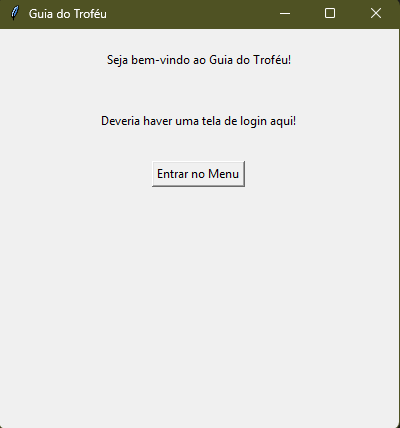
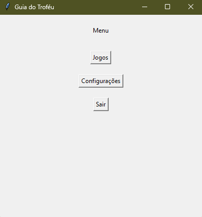
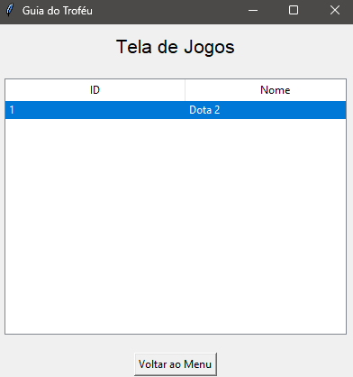

# 🏆 Guia de Troféus Steam

> Uma aplicação integrada à Steam para otimizar a caça por conquistas (achievements).

Esta aplicação permitirá a visualização organizada de jogos e conquistas da sua biblioteca Steam. Cada conquista possui uma interface dedicada contendo dicas, guias em vídeo, imagens e conteúdos explicativos para auxiliar na "platina" (100% de conclusão) dos jogos.

## 📸 Screenshots

Aqui estão algumas prévias da interface do projeto:

| Menu de Login | Menu de Seleção |
|:---:|:---:|
|  |  |
| Menu de Jogos |
|:---:|:---:|
|  |

---

## 🛠️ Funcionalidades

- **Sincronização com Steam:** Login via Steam OpenID e busca automática da biblioteca do usuário.
- **Dashboard de Progresso:** Visualização clara de quais jogos estão em progresso e quais foram completados.
- **Guias Detalhados:** Página específica para cada troféu com:
    - Descrição oficial.
    - Dificuldade estimada.
    - Links para vídeos do YouTube/guias da comunidade.
- **Filtros Inteligentes:** Filtrar conquistas por "Bloqueadas", "Desbloqueadas" ou "Ocultas".

## 🗺️ Roadmap

Este projeto está sendo desenvolvido em etapas. Abaixo, o status atual e os próximos passos:

---

## ⚙️ Fase 1: Backend e Integração (Core)

### 🔐 Autenticação
- [ ] Implementação da autenticação via **Steam OpenID**
- [ ] Captura e persistência do **SteamID** do usuário

### 🌐 Integração com Steam Web API
- [ ] Consumo da **Steam Web API** para:
  - [ ] Recuperar lista de jogos do usuário (*GetOwnedGames*)
  - [ ] Obter schema do jogo e lista de conquistas
  - [ ] Recuperar progresso do jogador (conquistas desbloqueadas)
- [ ] Normalização dos dados da API para o modelo interno do banco

### 💾 Persistência de Dados
- [x] Modelagem do banco de dados
- [x] Implementação do banco **SQLite**
- [x] Integração banco de dados ↔ aplicação
- [x] Salvamento de notas e dicas personalizadas por troféu
- [x] Implementação de cache para reduzir chamadas à Steam API

---

## 🎨 Fase 2: Interface (Frontend Desktop)

### 🧪 Planejamento
- [x] Prototipação das telas
- [x] Definição do fluxo de navegação
- [x] Arquitetura de navegação baseada em **Frames (Tkinter)**

### 🏠 Home / Dashboard
- [ ] Criação da Home com listagem de jogos
- [ ] Exibição de barra de progresso por jogo
- [ ] Indicadores de conquistas concluídas e pendentes

### 🎮 Página do Jogo
- [ ] Tela individual do jogo
- [ ] Listagem de troféus/conquistas
- [ ] Filtros por status (concluído / não concluído)
- [ ] Busca por nome da conquista

### 📄 Detalhes do Troféu
- [ ] Página ou modal de detalhes da conquista
- [ ] Exibição de descrição detalhada
- [ ] Suporte a vídeos externos (links)
- [ ] Campo para dicas e anotações personalizadas

### 📐 Experiência do Usuário
- [ ] Ajustes de layout
- [ ] Melhorias de usabilidade
- [ ] Responsividade dentro das limitações do Tkinter

---

## 🚀 Fase 3: Conteúdo, Qualidade e Evolução

- [ ] Polimento de UI/UX
- [ ] Padronização visual
- [ ] Feedbacks visuais e animações simples
- [ ] Tratamento de erros (perfil privado, falhas de API, ausência de conexão)
- [ ] Otimização do sistema de cache
- [x] Documentação completa do projeto (**README v1.0**)
- [ ] Planejamento de funcionalidades futuras

---

---

## 💻 Tecnologias Utilizadas

- **Front-end:**  Python
- **Back-end:** Python
- **Bibliotecas:** Tkinter
- **Banco de Dados:** SQLite
- **API:** Steam Web API

## 🚀 Sobre mim

Meu nome é **Jhonathan**, sou um estudante brasileiro de tecnologia de 20 anos. Meu foco é desenvolver soluções úteis enquanto aprimoro minhas habilidades em desenvolvimento Full Stack.

## 🔗 Links

